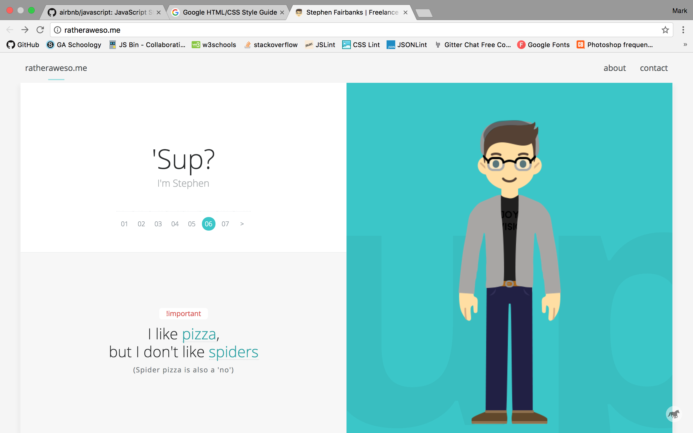

<!---
title: JavaScript Racer
type: lab
duration: Weekend
creator:
    name: Alex White
    city: SF
--->

# JavaScript Racer

## Introduction

We are going to implement a "racer game" using JavaScript, HTML and CSS.  This will be your second "formal" challenge to assess your knowledge of programming fundamentals and HTML/CSS.

You will be working individually for this assignment, but we'll be guiding you as you get started.

## Exercise

#### Requirements

- Your game should have two pages: a landing page and a game page
- Include separate HTML, CSS, JavaScript files
- Choose an existing landing page on the web; screen shot the landing page, and replicate its design to create a separate game landing page that links to your game\*
- Style your landing page and game page with class-based CSS
- Include a media query for a tablet to make your pages responsive
- Your game page must have at least two player objects
- Your game must have a clear win condition
- Comment your code appropriately
- Adhere to the [AirBnB style guide](https://github.com/airbnb/javascript) for writing your JavaScript
- Adhere to the [Google style guide](https://google.github.io/styleguide/htmlcssguide.xml) for writing your HTML/CSS

\* This does NOT mean copy-and-paste, you must work from the screen shot, not the code.

**Bonus:**

- Use images to create a background and/or players
- Score each game based on the time it took to complete and by how much time they beat the opposing player
- Display the time it took for the player to complete the race
- Make a 'Best of 3' tournament and display the winner of the tournament
- Keep track of best times/ high scores across page refreshes using `localStorage`
- Add animations
- Have players do something other than simply pressing a key to move their player, for example, make them type words, or solve simple math problems

#### Starter code

## Additional Resources
- JavaScript [documentation](https://developer.mozilla.org/en-US/docs/Web/JavaScript)
- An [excellent resource](https://developer.mozilla.org/en-US/docs/Web/Events) for working with the DOM in vanilla JavaScript resource for students
- [Should you learn DOM manipulation in JavaScript before jQuery?](https://www.reddit.com/r/javascript/comments/3hpm1v/should_i_learn_dom_manipulation_with_raw/)

#### Project Feedback + Evaluation

Your work will be evaluated using [this rubric](rubric.md).
